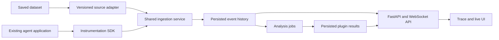

# Architecture and invariants

## One event envelope

`Fact(kind, data, occurred_at, source, id)` is the application input. The framework turns it into `Event(id, branch_id, position, kind, data, occurred_at, recorded_at, source, schema_version)` after applying the domain rules. Positions define replay order; timestamps place events on the visual timeline. They are separate because source records can have equal or imperfect clocks.

Agents, channels, messages, memory slots, tool calls, and environment have stable IDs. References use IDs, not nested copies. The event envelope carries timing and provenance. Each entity has a small set of common fields plus application metadata. Provider responses and large payloads can be stored by content digest and referenced in metadata. `observation.recorded` retains application observations that do not mutate a standard entity.

The reducer validates references and lifecycle transitions. For example, a message requires an existing channel and an active sender, and a completed tool call requires a running call. An agent removal preserves identity and prior history while changing its active state and channel membership.

## Branch semantics

A branch belongs to one run and records `parent_id`, `fork_position`, and `head`. Its effective history is its parent's prefix through the fork position followed by its own events. Parent events after the fork never become visible to the child. A child can itself be forked at any available cursor, including an inherited point before its own creation.

Replay loads the closest eligible snapshot, then applies events through the requested cursor. Reverse scrubbing reconstructs the earlier state; it does not attempt to undo mutations. Snapshots accelerate reads and can be regenerated from history. Reads return detached state, so a plugin cannot alter persisted history by editing an object it received.

Writes use an expected head. SQLite commits each batch and its relational projections atomically; an intervening writer produces a conflict. An ingest spanning multiple batches retains earlier successful batches if a later batch fails. Applications own retry/resume policy and stable source IDs. Runtime continuations also reject output if the branch changed while that output was being produced.

An intervention is another event with its actor and origin recorded. The UI creates a child at the visible cursor for each intervention and offers either saving the branch or running it live. Live execution validates the proposed state before creating the child; it never substitutes a different cursor. The library leaves branch policy to its embedding application and only permits appending at the current head.

Comments annotate history without becoming part of it. A comment anchors to one event of its branch's effective history. A branch shows its own comments and its ancestors' comments through each fork position, which is the same prefix rule that events use. Run bundles (`application/bundle.py`) export a run's branch tree with each branch's own events and comment threads, keyed by local branch keys and event positions. Import replays each branch once through the reducer (a child starts from its parent's state at the fork) and writes the run, events, snapshots and comments in one `HistoryStore.import_run` transaction. Export reads the run in one read transaction (`HistoryStore.run_contents`).

## SQLite and Git

SQLite is the query and replay store. It contains runs, branches, events, snapshots, analysis records, entity identities, and revision tables for agents, channels, membership, messages, memory, tools, and environment. Revision queries must follow branch ancestry and cursor limits; scanning a projection table alone combines multiple histories.

Git is the checkpoint/version adapter. A bare repository stores manifests, canonical state, and the branch's local events. A child checkpoint has the exact historical fork checkpoint as its ancestor. Creating an older checkpoint does not rewind a branch's latest ref. There is no shared mutable checkout. Git is not in the ingestion hot path, and there is no automatic merge of divergent agent runs.

SQLite commits and Git checkpoints are separate operations. A checkpoint failure does not roll back a valid SQLite event. Checkpointing is repeatable, and artifacts are stored separately by hash. Back up the SQLite database using its backup API and preserve `history.git` and `artifacts/` together when moving a workspace.

## Extension ownership

The application composes implementations of the ports. A source understands dataset-specific keys, joins, task boundaries, and ordering. A runtime knows how to provision an execution environment, restore supported state, and call models/tools. A plugin can read the selected state and event history, enumerate branches, fork, and submit interventions. Plugin constructors can receive application services such as an artifact store, model client, probe, or steering backend.

Plugin results persist the plugin version, configuration, selected branch/cursor, input history digest, and output. The provided Activity plugin counts recorded activity; it does not infer mental states or alignment outcomes.

For model-internal experiments, store the proposed intervention and its configuration in branch metadata/state, then have the runtime apply it and emit observations recording the actual result. A recorded state edit alone is not evidence that a provider or model applied the change.

## Scaling without changing the core

The current explorer loads one selected branch's event summaries and compact state. Timeline rendering limits event DOM nodes to the horizontal viewport. For larger runs, move timeline paging and aggregate state queries into a query adapter, reduce snapshot duplication, and queue runtime work. Replace SQLite with another `HistoryStore` if concurrent write load requires it. UI layouts, live subscriptions, and custom inspectors remain outer concerns.

## Optional observability

`observability/` supplies method protocols and a versioned plugin bridge; method-specific numerical code is isolated in subpackages such as `observability/caspian/`. It depends on the domain event type for its adapter contract, while the core/application do not import it. Application adapters define feature encoders, observed source/target pairs, and turn boundaries. Each plugin analysis starts a fresh monitor over the selected effective history prefix, preserving branch isolation. See [observability](observability/README.md) and [CASPIAN's specification limits](observability/caspian/coverage.md).

## Implementation priorities

Updated on 2026-10-03. Live collection and deployment remain planned. MAST saved-trace analysis, plugin API composition, UI discovery, and raw trace import are implemented; see the [MAST integration](observability/mast/README.md). Keep the existing dependency-free domain/application boundary and extend the outer adapters and presentation layer.

### Product modes and first milestone

**Trace mode:** load a supported saved dataset through a versioned source adapter, inspect its history, run analysis, and fork at a selected cursor. An import needs an explicit mapping; the application should not silently guess arbitrary dataset semantics.

**Live mode:** attach Swarm Lens instrumentation to an existing agent application, collect events while it executes, and update the browser. Persist those events so the finished run opens in trace mode without a second representation or a new import. Pausing the browser's live-follow mode must not pause collection or analysis.

The first complete milestone is one existing CrewAI task observed live in the browser, retained across a server restart, and reopened as the same saved trace. An analysis plugin must be discoverable from the UI in both modes. Build this milestone before adding more framework integrations.

### Delivery order

| Priority | Deliverable | Acceptance criterion |
| --- | --- | --- |
| 1 | Shared ingestion contract for saved and live events | Replaying a captured run produces the same domain history/state; retrying an acknowledged event does not duplicate it. Source/adapter versions and event lineage survive persistence. |
| 2 | Plugin registration, API composition, and UI discovery | Register a plugin in application configuration; after startup its namespaced routes, configuration form, actions, and results are available without editing the core or hardcoding its ID in the UI. |
| 3 | Live delivery and the first framework adapter | Observe an existing pinned CrewAI task, reconnect the browser, recover missed events, and inspect a historical cursor while collection continues. |
| 4 | Docker packaging for that complete flow | Docker Compose boots the application and registered plugins, serves the UI/API, passes a health check, and preserves runs/artifacts/results after restart using a mounted data volume. |
| 5 | Background analysis and runtime-backed experiments | MAST analyzes a saved prefix on demand; CASPIAN remains an experimental library method without a dedicated API; long jobs do not block ingestion or WebSocket delivery. A fork generates new agent responses only through a registered compatible runtime. |

### Shared data and instrumentation

Extend the existing `Fact`/`Event` envelope rather than introducing separate live and offline schemas. Retain stable run, branch, agent, channel, message, and tool-call identities; source timestamps; server-assigned sequence positions; schema version; and original source IDs. Source provenance should record framework/package version, upstream commit when available, application revision, adapter version, and model/configuration metadata relevant to replay.

Persist actual input/output and delivery references when the source exposes them. Record missing evidence explicitly. Similar wording or simultaneous events do not establish that one agent consumed another's output. Preserve raw payloads through the existing artifact store when appropriate. Use `observation.recorded` for source-specific facts that do not yet have standard entity semantics.

A small SDK should offer explicit initialization plus decorators/context managers for application task boundaries and custom tools. Framework adapters should use the framework's supported listeners/hooks to collect internal events. Instrumentation must observe existing tasks without requiring their orchestration to move into Swarm Lens. Pin the first supported framework release and dependency lock, record its upstream revision, and commit the adapter with compatibility fixtures. Additional versions require explicit compatibility checks.

Collectors send batches to the ingestion API with stable source IDs. Acknowledge only durable writes; provide bounded buffering/retry and visible delivery failures. Define per-run ordering and correlation for concurrent callbacks. Observability errors or a disconnected browser must not terminate the agent task. Collection loss must be reported, never silently treated as a complete trace.

**Implemented first integration: CrewAI 1.15.23.** The optional adapter uses native LLM/tool hooks, memory events, and task callbacks to capture synchronous crew execution. The live service provides idempotent capture ingestion, durable job status, and resumable WebSocket delivery. Registered `CrewAIRuntime` factories restore sequential task boundaries or restart the active task with the selected saved context; unsupported executor/external state is rejected. `TraceCrewAIRuntime` reconstructs imported conversations as native CrewAI tasks: ACIArena keeps its sequential debater/aggregator round structure, while generic traces use explicit round-robin scheduling over saved connections. Tool implementations come from a trusted server registry. Both paths keep the selected fork cursor, record their execution mode, and exclude later parent events. Reconstructed continuation does not imply exact reproduction of the original framework. See [setup, supported state, and compatibility tests](../examples/crewai/README.md). [CrewAI event listeners](https://docs.crewai.com/en/concepts/event-listener). AutoGen remains a possible later adapter; its repository currently describes it as being in maintenance mode. [AutoGen status](https://github.com/microsoft/autogen).

### One FastAPI application with plugin extensions

Keep one server responsible for the landing page, existing history API, ingestion, live subscriptions, and plugin routes. Add an explicit trusted plugin registry to the application composition root. A plugin registration describes its ID/version, configuration schema, supported modes, analysis actions/result schemas, optional router, and startup/shutdown resources. Reject duplicate IDs and route collisions during startup.

Include each plugin's `APIRouter` under a stable namespace such as `/api/plugins/{plugin_id}` using FastAPI's router composition. Keep FastAPI dependencies in web extensions; the existing analysis `Plugin` protocol and numerical methods remain usable without a web server. [FastAPI router composition](https://fastapi.tiangolo.com/tutorial/bigger-applications/).

Extend the existing `/api/workspace` capability response with the registered plugin manifests. On boot, the browser uses these manifests to expose available actions, configuration forms, results, and status. API registration alone does not create a usable frontend: provide a generic schema-driven panel first and an explicit renderer registration for richer visualizations. Disabled plugins should not advertise unavailable actions.

Both standard and plugin routes share application services, error handling, and the same authentication/origin policy when self-hosted. Installing/configuring a plugin and restarting the application is the initial registration model; runtime installation and hot reloading are outside the first milestone.

### Real-time history and jobs

Publish event notifications only after history commits. WebSocket clients subscribe by run/branch and reconnect using the last persisted sequence position. Recover missed history through a paged catch-up API, deduplicate by event identity, and handle the catch-up/subscription boundary without gaps. Slow consumers need bounded queues and a resynchronization path. UI subscriptions and analysis job updates share the same application, with distinct message types and cursors.

Keep a live-follow toggle separate from the selected history cursor. A user can pause at an earlier event, inspect or fork there, and return to the latest event while ingestion continues. Persist run completion/failure separately from temporary transport disconnection.

Long-running or model-backed analyses run as jobs with persisted status, input branch/cursor or live watermark, input digest, plugin/model version, configuration, and results. Start with a local worker and SQLite; handle process interruption explicitly. Avoid one LLM call per token: each plugin declares its analysis cadence, such as completed messages or logical rounds. Analysis outputs are separate from the observed conversation and must not recursively trigger analysis of the plugin's own LLM calls.

MAST is the selected LLM tracing plugin. Expose on-demand saved-trace analysis through its own sub-API and UI; do not run MAST live or automatically as events arrive. Keep collection independent from analysis. Future intervention features may propose changes for review. Apply an intervention through the existing fork/event APIs. Continuing that fork additionally requires a runtime that can restore the relevant framework/tool state; a saved conversation alone does not promise arbitrary execution restoration.

### CASPIAN's status and behavior

Retain CASPIAN as optional and **experimental**. We have not established reliable independent cascade labels or validated its detection accuracy. An alert is a method output, not a verified cascade, attack, or harmful behavior; cascade effects need not be harmful. Equation tests and successful execution do not establish scientific validity.

Keep CASPIAN available through its library and existing experiment artifacts; a dedicated CASPIAN web API is out of scope. Preserve its measurements, instant decisions, multi-round confirmation, first detection time, method configuration, adapter/embedding provenance, and available evidence. Continue measurement until the input run ends, including after the first alert. Use the same ordered observations for historical and live analysis, with isolated monitor state per branch and configuration. The current text-embedding choice remains `text-embedding-3-small` where text features are needed.

Enabling or disabling CASPIAN must not affect collection, replay, other plugins, or the agent application's execution. Validation remains a separate research task; keeping the plugin does not imply the paper's results have been reproduced.

### Local and container deployment

Ship a Dockerfile and Compose configuration for the API, browser assets, configured plugins, and local analysis worker. Start with one API process so live notification ownership is explicit. Persist SQLite, Git checkpoints, artifacts, and job records in a mounted data directory. Inject credentials/configuration at runtime; keep them out of the image and frontend. Provide health checks, graceful collector/job shutdown behavior, and a documented self-hosting configuration that covers HTTP and WebSocket connections.

The first acceptance exercise should capture a short real framework task, display it live, reconnect the browser, finish capture, restart the server, and inspect/analyze the exact saved run. Synthetic fixtures additionally verify ordering, retries, branch isolation, plugin registration, and continued measurement after an alert. This verifies the platform's behavior without presenting CASPIAN's outputs as validated cascade labels.
